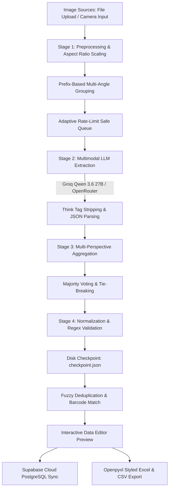

# 🏷️ Vision-LM: AI-Driven Image-to-IMDB Tool
> **GDSS-Maverick Hackathon 2026** · Enterprise AI-Driven Multimodal Packaging-to-Item Master Data Pipeline

[](https://gdss-hackathon-aw2swnadk2wp8eka4nmb2k.streamlit.app/)
[](https://www.python.org/downloads/)
[](LICENSE)
[](https://groq.com/)
[](https://openrouter.ai/)
[](https://supabase.com/)

---

## 🌐 Overview & Live Demo

**Vision-LM** is an enterprise-grade multimodal computer vision and LLM parsing pipeline engineered to extract structured retail **Item Master Data (IMDB)** directly from physical product packaging photographs. 

* **Live Web Application**: [GDSS Hackathon Production App](https://gdss-hackathon-aw2swnadk2wp8eka4nmb2k.streamlit.app/)
* **Core Mission**: Automates cataloging of 13 standardized retail attributes directly from multi-angle packaging shots, eliminating manual data entry while ensuring strict data normalization, duplicate resolution, and cloud catalog synchronization.

---

## ⚡ Key Capabilities

* **🧠 High-Speed Multimodal Vision AI**:
  * **Groq Cloud Developer Tier (Default)**: High-speed inference using **`qwen/qwen3.6-27b`** with integrated `<think>` reasoning tag sanitization and raw JSON extraction (~2.0s–3.0s latency).
  * **OpenRouter Free Tier (Fallback)**: Seamless multi-model fallback supporting `google/gemma-4-26b-a4b-it:free`, `qwen/qwen-2.5-vl-72b-instruct:free`, and `meta-llama/llama-3.2-11b-vision-instruct:free`.
* **📸 Dual Image Ingestion Modes**:
  * **Batch File Uploader**: Drag-and-drop multiple high-resolution photos with automatic prefix-based grouping (`<ProductID>_<angle>.jpg`).
  * **Live Device Camera Input**: Direct mobile/tablet/desktop webcam capture with on-the-fly SKU prefix tagging and snapshot queue management.
* **🛡️ Fault-Tolerant Checkpoint Engine (`checkpoint.json`)**:
  * Automatically checkpoints progress to disk after each completed product group.
  * Resilient against network interruptions or browser reloads; automatically resumes from the last unprocessed product and cleans up upon final export.
* **⏱️ Adaptive Rate-Limit Pacing & Backoff**:
  * Sequential request queue with adaptive sleep pacing window (`GROQ_DELAY_SEC = 5-6s`) to remain strictly within free-tier rate limits.
  * Multi-attempt exponential backoff (starting at 30s) automatically recovering from HTTP 429 rate-limit responses.
* **🔄 Fuzzy Deduplication & Smart Aggregation**:
  * Cross-image consensus aggregation via majority voting (`Counter.most_common(1)`) with longest-string tiebreakers.
  * Barcode sequence matching with SequenceMatcher tolerance ($>0.85$) to catch minor OCR character distortions.
  * Brand and product similarity resolution ($>0.80$) paired with weight/size validation guards to avoid false duplicate merges across pack sizes.
* **☁️ Cloud Catalog Sync (Supabase PostgreSQL)**:
  * Automatic cloud upsert to the `imdb_products` table.
  * Tracks `scan_count` per SKU to detect repeat scans and maintain catalog audit trails.
* **📊 Dual-View Interactive Web UI**:
  * **🏭 Pipeline View**: 5-step interactive workflow (Upload $\rightarrow$ Extract $\rightarrow$ Aggregate $\rightarrow$ Validate $\rightarrow$ Export) with an editable data grid (`st.data_editor`) for manual review.
  * **📊 Item Master Database View**: Real-time searchable and filterable catalog grid querying Supabase directly.
* **📥 Enterprise Excel & CSV Export**:
  * Pixel-perfect `.xlsx` workbook generation via `openpyxl` conforming to hackathon standards: Calibri typography (11pt bold headers, 10pt data), medium header borders, thin gridlines, freeze panes (`A2`), and auto-fitted column widths.
  * Instant one-click `.csv` export.
* **🧪 7-Stage Comprehensive QA Test Suite**:
  * Fully automated test harness in `test_pipeline_qa.py` verifying image resizing, deduplication, aggregation, schema adherence, normalization, end-to-end mock execution, and Excel styling.

---

## 📐 Pipeline Architecture



### Stage Breakdown:
1. **Stage 1 — Ingestion & Preprocessing**:
   - Images are validated, converted from RGBA/palette modes to RGB, dynamically resized down to $\le 1024\times 1024$ preserving aspect ratios, and encoded as base64 data URIs.
   - Filename prefixes (e.g. `S221234199_front.jpg` $\rightarrow$ `S221234199`) identify multi-angle photos for the same SKU.
2. **Stage 2 — Multimodal Extraction**:
   - Preprocessed base64 payloads are dispatched to OpenAI-compatible endpoints with strict system instructions and zero preamble.
   - Raw output is sanitized to remove `<think>...</think>` tags and extract pure JSON.
3. **Stage 3 — Aggregation & Conflict Resolution**:
   - Multiple perspectives of a single item are combined using majority consensus voting (`Counter.most_common(1)`).
   - Ties are broken by selecting the longest candidate string, ensuring maximum descriptive detail.
4. **Stage 4 — Validation, Normalization & Checkpointing**:
   - Non-numeric characters stripped from barcodes (`[^\d]`).
   - Spaces removed between weight values and units (`500 G` $\rightarrow$ `500G`), and leading/trailing whitespace removed.
   - Uppercase applied uniformly across all string attributes; empty strings `""` substituted for missing fields (never `null`).
   - Processed record immediately saved to `checkpoint.json` for crash resilience.

---

## 📋 The 13 IMDB Columns & Data Dictionary

| Column | Description | Format & Normalization Rules | Example |
| :--- | :--- | :--- | :--- |
| **ITEM NAME** | Full descriptive product name | Title with brand, variant, type, and size in uppercase | `KNORR CHICKEN STOCK CUBE 20G` |
| **BARCODE** | EAN / UPC numeric digits | Strictly digits only (no spaces, dashes, or non-numeric characters) | `5000118047984` |
| **MANUFACTURER** | Producing company name | Registered company name as printed on packaging | `UNILEVER GHANA PLC` |
| **BRAND** | Brand name | Extracted brand name in uppercase | `KNORR` |
| **WEIGHT** | Net weight or volume | Number concatenated directly with uppercase unit (no space) | `20G`, `1L`, `500ML`, `2.2KG` |
| **PACKAGING TYPE** | Standard container category | Category string (`SACHET`, `BOX`, `BOTTLE`, `CAN`, `BAG`, `CARTON`, etc.) | `BOX` |
| **COUNTRY** | Country of origin | Country name as printed on packaging | `GHANA` |
| **VARIANT** | Specific formula or flavor | Sub-type or flavor descriptor | `CHICKEN`, `ORIGINAL`, `REDUCED SALT` |
| **TYPE** | Product category | General catalog classification | `SEASONING`, `SOAP`, `DETERGENT` |
| **FRAGRANCE FLAVOR**| Scent or taste descriptor | Flavor or perfume notes | `CHICKEN`, `ROSE`, `VANILLA` |
| **PROMOTION** | Promotional text | Special offers printed on pack | `BUY 2 GET 1 FREE`, `20% EXTRA` |
| **ADDONS** | Packaged bonus items | Included free gifts or extras | `FREE SPOON INSIDE` |
| **TAGLINE** | Marketing slogan | Slogan or brand catchphrase | `TASTE THE DIFFERENCE` |

---

## 🤖 Supported Vision AI Models

### 1. Groq Cloud (Default Provider)
* **`qwen/qwen3.6-27b`**: Groq's active high-speed multimodal vision AI model. Delivers superior OCR, packaging comprehension, and attribute extraction at ~2.5s per image with zero token cost under the free developer quota. Includes integrated `<think>` tag stripping.

### 2. OpenRouter (Alternative Free Provider)
* **`google/gemma-4-26b-a4b-it:free`**: Balanced open-source multimodal extraction.
* **`qwen/qwen-2.5-vl-72b-instruct:free`**: Superior fine-print and nutrition panel OCR.
* **`meta-llama/llama-3.2-11b-vision-instruct:free`**: Lightweight vision model.

---

## 🛠️ Installation & Setup

### Prerequisites
* Python 3.10, 3.11, or 3.12
* Free API key from [GroqCloud Console](https://console.groq.com/) or [OpenRouter](https://openrouter.ai/)
* *(Optional)* Free project credentials from [Supabase](https://supabase.com/)

### 1. Clone the Repository
```bash
git clone https://github.com/hendrix-llouchi/Vision-LM.git
cd Vision-LM
```

### 2. Create & Activate Virtual Environment

**Windows (PowerShell):**
```powershell
python -m venv .venv
.venv\Scripts\Activate.ps1
```

**Linux / macOS:**
```bash
python3 -m venv .venv
source .venv/bin/activate
```

### 3. Install Dependencies
```bash
pip install -r requirements.txt
```

### 4. Configure Environment Secrets
Create a `.env` file in the root directory (or `.streamlit/secrets.toml` for Streamlit Cloud):

```ini
# .env
GROQ_API_KEY="gsk_your_groq_api_key_here"
OPENROUTER_API_KEY="sk-or-v1-your_openrouter_api_key_here"

# Supabase Cloud Database (Optional)
SUPABASE_URL="https://your-project.supabase.co"
SUPABASE_KEY="your-supabase-anon-key"
```

For Streamlit Cloud, configure via `.streamlit/secrets.toml`:
```toml
# .streamlit/secrets.toml
GROQ_API_KEY = "gsk_your_groq_api_key_here"
OPENROUTER_API_KEY = "sk-or-v1-your_openrouter_api_key_here"
SUPABASE_URL = "https://your-project.supabase.co"
SUPABASE_KEY = "your-supabase-anon-key"
```

---

## 🚀 Running the Application

### Option A: Launch Interactive Streamlit Web UI
```bash
streamlit run app.py
```
Open your browser at `http://localhost:8501`.
* Switch between **🏭 Pipeline** and **📊 Item Master Database** from the top glassmorphism navigation capsule.
* Configure API keys directly in the **⚙️ Model Configuration** expander or let them load automatically from environment secrets.

### Option B: Run Batch CLI Pipeline
```bash
python pipeline.py
```
* Processes images from `./images` (or configured directory).
* Automatically groups multi-angle photos by filename prefix.
* Checkpoints progress to `./checkpoint.json` and outputs formatted results to `./IMDB_predictions.xlsx`.

### Option C: Run Automated QA Test Suite
```bash
python test_pipeline_qa.py
```
* Executes the complete 7-stage automated test harness on all 10 sample images.
* Validates image ingestion, fuzzy deduplication, aggregation, normalization, schema matching, and Excel styling.
* Generates a structured test audit report in `test_report.json`.

### Option D: Run Fuzzy Deduplication Tests
```bash
python test_fuzzy.py
```
* Runs targeted fuzzy matching comparisons and SequenceMatcher threshold verification.

---

## 📁 Repository Structure

```
Vision-LM/
├── .streamlit/
│   ├── config.toml                     # Streamlit custom theme & styling configuration
│   └── secrets.toml                    # Local API credentials (git-ignored)
├── sample_images/                      # 10 verified test retail packaging images
│   ├── S221234199_550719011.jpg        # Knorr Stock Cube
│   ├── S221712802_552034737.jpg        # Sunlight Dishwashing Liquid
│   ├── S222775012_554946386.jpg        # Maggi Instant Noodles
│   ├── S222894050_555598635.jpg        # Colgate Total Toothpaste
│   ├── S222985766_556022646.jpg        # Dutch Lady Milk
│   ├── S225637028_565425767.jpg        # Milo Activ-Go Powder
│   ├── S229358414_573881288.jpg        # Kilif Detergent Powder
│   ├── S229688224_574564716.jpg        # Kivo Tomato Mix
│   ├── S230256650_576140697.jpg        # Ajinomoto Umami Seasoning
│   └── S233065853_583213887.jpg        # Life Tomato Ketchup
├── app.py                              # Streamlit dual-view UI, camera & cloud sync application
├── pipeline.py                         # Headless CLI batch processing & extraction engine
├── test_fuzzy.py                       # Duplicate matching & fuzzy comparison tests
├── test_pipeline_qa.py                 # Comprehensive 7-stage automated QA test harness
├── test_report.json                    # Machine-readable test audit results from QA suite
├── IMDB_predictions.xlsx               # Generated formatted reference submission workbook
├── IMDB_predictions_submission.xlsx    # Benchmark reference submission workbook
├── requirements.txt                    # Project Python dependencies
├── .env.example                        # Example environment configuration
├── LICENSE                             # MIT License
└── README.md                           # Project documentation
```

---

## 🗄️ Supabase Database Schema

To enable cloud synchronization with Supabase, create the `imdb_products` table in your PostgreSQL database:

```sql
CREATE TABLE IF NOT EXISTS imdb_products (
    id BIGINT GENERATED BY DEFAULT AS IDENTITY PRIMARY KEY,
    item_name TEXT NOT NULL,
    barcode TEXT,
    manufacturer TEXT,
    brand TEXT,
    weight TEXT,
    packaging_type TEXT,
    country TEXT,
    variant TEXT,
    type TEXT,
    fragrance_flavor TEXT,
    promotion TEXT,
    addons TEXT,
    tagline TEXT,
    scan_count INTEGER DEFAULT 1,
    last_updated TIMESTAMP WITH TIME ZONE DEFAULT timezone('utc'::text, now()),
    created_at TIMESTAMP WITH TIME ZONE DEFAULT timezone('utc'::text, now())
);

-- Index for high-speed brand and item name searches
CREATE INDEX IF NOT EXISTS idx_imdb_brand ON imdb_products(brand);
CREATE INDEX IF NOT EXISTS idx_imdb_item_name ON imdb_products(item_name);
```

---

## 📄 License

This project is licensed under the [MIT License](LICENSE).