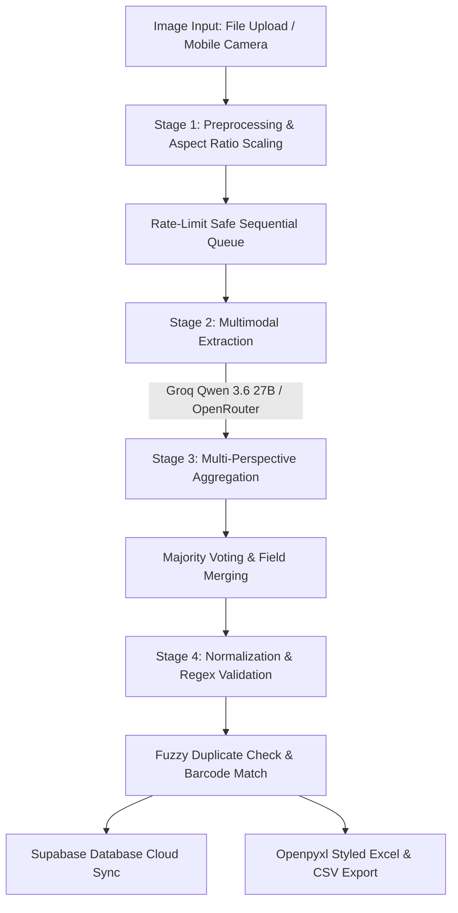

# 🏷️ Vision-LM: AI-Driven Image-to-IMDB Tool
> **GDSS-Maverick Hackathon 2026** · Enterprise AI-Driven Multimodal Packaging-to-Item Master Data Pipeline

[](https://gdss-hackathon-aw2swnadk2wp8eka4nmb2k.streamlit.app/)
[](https://www.python.org/downloads/)
[](LICENSE)
[](https://groq.com/)
[](https://openrouter.ai/)

---

## 🌐 Overview & Live Demo

**Vision-LM** is an end-to-end computer vision and LLM parsing pipeline engineered to extract structured retail **Item Master Data (IMDB)** directly from product packaging photographs. 

* **Live Web Application**: [GDSS Hackathon Production App](https://gdss-hackathon-aw2swnadk2wp8eka4nmb2k.streamlit.app/)
* **Core Function**: Parses 13 standardized catalog attributes (Item Name, Barcode, Manufacturer, Brand, Weight, Packaging Type, Country, Variant, Type, Fragrance/Flavor, Promotion, Addons, Tagline) from multi-angle retail images with automated conflict resolution, fuzzy deduplication, and cloud synchronization.

---

## ⚡ Key Capabilities

* **🧠 Multimodal Vision AI Models**:
  * **Groq Cloud (100% Free Developer Tier)**: High-speed multimodal inference using **`qwen/qwen3.6-27b`** with integrated `<think>` tag sanitization and JSON parsing (~2.5s–3.0s latency).
  * **OpenRouter Free Tier**: Multimodal fallback supporting `google/gemma-4-26b-a4b-it:free`, `qwen/qwen-2.5-vl-72b-instruct:free`, and `meta-llama/llama-3.2-11b-vision-instruct:free`.
* **📸 Live Mobile Camera & Batch Uploader**: Instant capture directly from mobile devices or desktop file upload with prefix-based multi-image grouping (e.g., `S221234199_front.jpg` & `S221234199_back.jpg` automatically grouped as a single SKU).
* **⏱️ Rate-Limit Safe Sequential Queue**: Enforces an adaptive pacing window and exponential backoff to ensure smooth execution within Groq's 8,000 TPM free-tier quota.
* **🔄 Fuzzy Deduplication & Smart Merge**:
  * Barcode OCR matching with SequenceMatcher tolerance ($>0.85$).
  * SKU brand and item name similarity resolution with size/weight validation guards.
  * Cross-image attribute merging with scan counter incrementing.
* **☁️ Supabase Cloud Synchronization**: Instant sync to PostgreSQL `imdb_products` table.
* **📊 Item Master Database UI**: Real-time searchable data grid with live duplicate alerts, inline SKU filtering, and bulk wipe actions.
* **📥 Enterprise Excel & CSV Export**: Formatted `.xlsx` generation using `openpyxl` with Calibri headers, thin cell borders, freeze panes (`A2`), and auto-fitted column widths.

---

## 📐 Pipeline Architecture



### Stage Breakdown:
1. **Stage 1 — Ingestion & Preprocessing**: Images are validated, converted to RGB, dynamically resized to $\le 1024\times 1024$ preserving aspect ratios, and encoded as base64 data URIs. Filename prefixes identify multi-angle photos for the same item.
2. **Stage 2 — Multimodal Extraction**: Base64 payloads are sent via OpenAI-compatible endpoints with strict JSON schema instructions.
3. **Stage 3 — Aggregation & Conflict Resolution**: Multi-image extractions for a single product are merged via majority consensus voting (`Counter.most_common(1)`), using longest-string tiebreakers.
4. **Stage 4 — Validation, Normalization & Export**: 
   - Non-numeric characters stripped from barcodes.
   - Spaces removed between weight values and units (`500 G` $\rightarrow$ `500G`).
   - Uppercase applied across all string fields; empty strings `""` substituted for missing attributes (never `null`).

---

## 📋 The 13 IMDB Columns & Data Dictionary

| Column | Description | Format & Normalization Rules | Example |
| :--- | :--- | :--- | :--- |
| **ITEM NAME** | Full descriptive product name | Title with brand, variant, type, and size in uppercase | `KNORR CHICKEN STOCK CUBE 20G` |
| **BARCODE** | EAN / UPC numeric digits | Strictly digits only (no spaces, dashes, or non-numeric chars) | `5000118047984` |
| **MANUFACTURER** | Producing company name | Registered company name as printed | `UNILEVER GHANA PLC` |
| **BRAND** | Brand name | Extracted brand name in uppercase | `KNORR` |
| **WEIGHT** | Net weight or volume | Number concatenated directly with uppercase unit (no space) | `20G`, `1L`, `500ML`, `2.2KG` |
| **PACKAGING TYPE** | Standard container category | Category string (`SACHET`, `BOX`, `BOTTLE`, `CAN`, `BAG`, etc.) | `BOX` |
| **COUNTRY** | Country of origin | Country name as printed on packaging | `GHANA` |
| **VARIANT** | Specific formula or flavor | Sub-type or flavor descriptor | `CHICKEN`, `ORIGINAL`, `REDUCED SALT` |
| **TYPE** | Product category | General category classification | `SEASONING`, `SOAP`, `DETERGENT` |
| **FRAGRANCE FLAVOR**| Scent or taste descriptor | Flavor or perfume notes | `CHICKEN`, `ROSE`, `VANILLA` |
| **PROMOTION** | Promotional text | Special offers printed on pack | `BUY 2 GET 1 FREE`, `20% EXTRA` |
| **ADDONS** | Packaged bonus items | Included free gifts or extras | `FREE SPOON INSIDE` |
| **TAGLINE** | Marketing slogan | Slogan or brand catchphrase | `TASTE THE DIFFERENCE` |

---

## 🤖 Supported Vision AI Models

### 1. Groq Cloud (Free Developer Tier)
* **`qwen/qwen3.6-27b`** *(Default)*: Groq's active multimodal vision AI model. Offers fast OCR, packaging comprehension, and attribute extraction. Features built-in `<think>` tag stripping and structured JSON parsing.

### 2. OpenRouter (Free Multimodal Tier)
* **`qwen/qwen-2.5-vl-72b-instruct:free`**: Superior small-text and nutrition panel OCR.
* **`google/gemma-4-26b-a4b-it:free`**: Balanced open-source multimodal extraction.
* **`meta-llama/llama-3.2-11b-vision-instruct:free`**: Standard open Llama vision model.

---

## 🛠️ Installation & Setup

### Prerequisites
* Python 3.10, 3.11, or 3.12
* Free API key from [GroqCloud Console](https://console.groq.com/) or [OpenRouter](https://openrouter.ai/)

### 1. Clone the Repository
```bash
git clone https://github.com/hendrix-llouchi/Vision-LM.git
cd Vision-LM
```

### 2. Create & Activate Virtual Environment
```powershell
# Windows (PowerShell)
python -m venv .venv
.venv\Scripts\Activate.ps1

# Linux / macOS
python3 -m venv .venv
source .venv/bin/activate
```

### 3. Install Dependencies
```bash
pip install -r requirements.txt
```

### 4. Configure Secrets (Optional)
Create `.streamlit/secrets.toml` or `.env`:

```toml
# .streamlit/secrets.toml
GROQ_API_KEY = "gsk_your_groq_api_key_here"
OPENROUTER_API_KEY = "sk-or-v1-your_openrouter_api_key_here"

# Supabase (Optional)
SUPABASE_URL = "https://your-project.supabase.co"
SUPABASE_KEY = "your-supabase-anon-key"
```

---

## 🚀 Running the Application

### Option A: Launch Interactive Streamlit Web UI
```bash
streamlit run app.py
```
Open your browser at `http://localhost:8501`.

### Option B: Run Batch CLI Pipeline
```bash
python pipeline.py
```
Outputs predictions to `./IMDB_predictions.xlsx`.

### Option C: Run QA & Automated Tests
```bash
python test_pipeline_qa.py
```

---

## 📁 Repository Structure

```
Vision-LM/
├── .streamlit/
│   ├── config.toml                 # Streamlit theme & UI styling settings
│   └── secrets.toml                # Local API credentials (git-ignored)
├── sample_images/                  # 10 verified test packaging images
├── app.py                          # Streamlit UI & camera processing application
├── pipeline.py                     # CLI batch processing & extraction engine
├── test_fuzzy.py                   # Duplicate matching & fuzzy comparison tests
├── test_pipeline_qa.py             # End-to-end automated test harness
├── IMDB_predictions_submission.xlsx # Formatted reference submission workbook
├── requirements.txt                # Python project dependencies
├── LICENSE                         # MIT License
└── README.md                       # Documentation
```

---

## 📄 License

This project is licensed under the [MIT License](LICENSE).